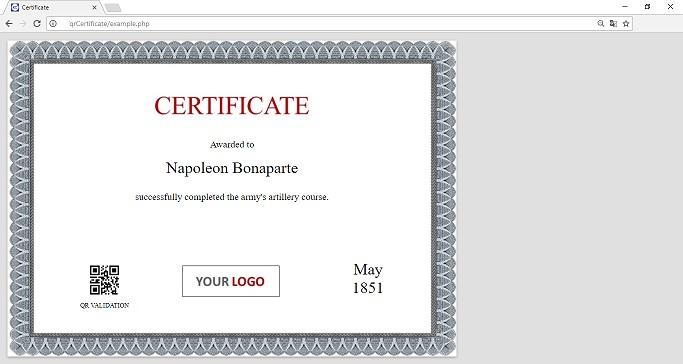

# Dynamic certificates with QR Code 
Create dynamic course certificates. Render on A4 printable area. Print with QR Code to redirect to an url and validate the certificate.

##You will also need
[paper-css](https://github.com/cognitom/paper-css)
For the A4 formating printable area.

[phpqrcode](https://github.com/t0k4rt/phpqrcode)
Generates the qrcode images 

## Example
```php
require_once('qrCertificate/qrCertificate.php');

$qr = new qrCertificate;
$qr->backgroundImg="qrCertificate/templateBackground.jpg";
$qr->acknowledge="Awarded to";
$qr->name="Napoleon Bonaparte";
$qr->achievement="successfully completed the army's artillery course.";
$qr->qr='https://en.wikipedia.org/wiki/Napoleon';
$qr->date="May<br>1851";

$qr->render()
```



